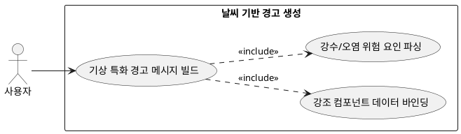

## 7.2.2 날씨 기반 경고 메시지 생성

### 개요
단순 기온 외에 강수 확률, 장마, 폭설, 미세먼지 등 의류 오염 및 물리적 차단 유발 기상 인자를 판별하여 패션 소품(우산 등) 휴대나 특수 소재 착용 경고를 생성하는 기능이다.

### 요구사항

(Claude가 작성, 검토 필요)

1. 강수 및 습도 인자 확인 시 "장마철 집중 호우가 예상되므로 방수 기능이 없는 로퍼 대신 스니커즈 착용을 권장하며 우산을 지참하세요" 등의 기상 특화 경고를 빌드한다.
2. 도출된 특수 경고 스트링을 코디 추천 결과 레이아웃의 최상단 혹은 강조 컴포넌트에 매핑한다.

---

### 유스케이스 다이어그램
