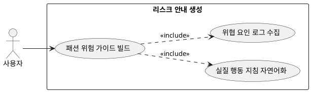

## 7.2 리스크 안내 생성

### 개요
유저의 안전하고 쾌적한 야외 활동을 위해 환경 위협 요소를 직관적으로 인지할 수 있는 가이드라인 및 위험 경고 컴포넌트를 텍스트 바디로 구축하는 기능이다.

### 요구사항

(Claude가 작성, 검토 필요)

1. 6.5절에서 연산 완료된 기온 급변동 수치 및 특수 기상 이변 로그 데이터를 수집한다.
2. 유저가 직관적으로 대처할 수 있는 실질적 행동 지침 형태의 자연어로 데이터를 정형화한다.

---

### 유스케이스 다이어그램
