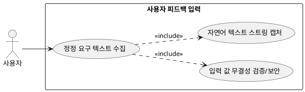

## 7.3.1 사용자 피드백 입력 기능

### 개요
사용자가 추천 화면 하단의 대화형 텍스트 박스를 활용하여 현재 출력된 3~4셋의 코디 조합 중 특정 부분의 정정을 자유롭게 자연어로 요구할 수 있도록 접점을 제공하는 기능이다.

### 요구사항

(Claude가 작성, 검토 필요)

1. 유저로부터 "좀 더 캐주얼하게", "검정색 옷 비율 줄여줘", "덜 더워 보이게" 등의 변경 텍스트 스트링을 입력받는다.
2. 입력 폼의 글자 수 제한 검증 및 악성 스크립트 인젝션 차단 전처리를 수행한 뒤 메모리 객체에 담는다.

---

### 유스케이스 다이어그램
