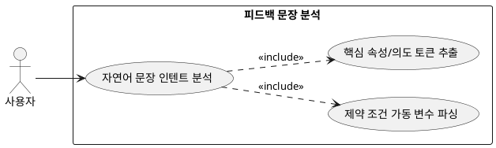

## 7.3.2 피드백 문장 분석

### 개요
자연어 처리(NLP) 기법 및 LLM 인텐트 파싱 기능을 가동하여 유저가 입력한 수정 요구 문장 속 숨겨진 타깃 카테고리, 스타일 변경 의도, 기피 색상 개체를 명확히 분류하는 기능이다.

### 요구사항

(Claude가 작성, 검토 필요)

1. "검정색 옷 비율 줄여줘" 문장에서 색상 속성 black과 부정 의도 decrease를 토큰 단위로 추출한다.
2. "덜 더워 보이게" 문장에서 기온 필터 제약 조건을 정량적으로 하향 조정해야 한다는 매칭 컨텍스트 변수가 파싱한다.

---

### 유스케이스 다이어그램
