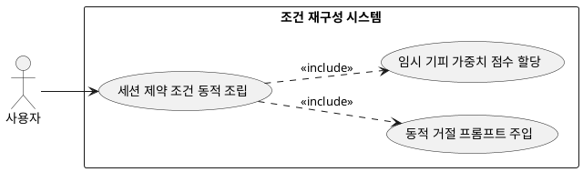

## 7.3.3 조건 재구성

### 개요
분석된 피드백 인자를 기반으로 당해 추천 세션에 즉시 효력을 발휘하는 임시 마이너스 가중치 점수를 할당하고, 동적 프롬프트 구조안에 거절 명령 조건문(system_instruction)을 실시간 재구성하는 기능이다.

### 요구사항

(Claude가 작성, 검토 필요)

1. 기피 대상으로 분석된 색상 속성에 대해 세션 리미트 일시적 가중치 -5점의 분기 처리를 백엔드 메모리에 반영한다.
2. LLM의 다음 프롬프트 주입 파트에 "유저 옷장에 블랙 아이템이 있더라도 가급적 추천 조합에서 제외하거나 우선순위를 극도로 낮추십시오"라는 제약 프롬프트를 동적 조립한다.

---

### 유스케이스 다이어그램
