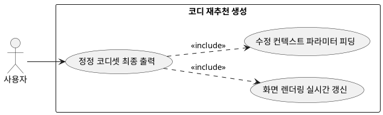

## 7.3.4 코디 재추천 생성

### 개요
재구성된 프롬프트와 피드백 컨텍스트 세트를 메인 LLM 엔진에 다시 피딩(Feeding)하여, 유저의 실시간 지적 사항이 완벽히 수정·보완된 새로운 다중 코디 후보군 리스트를 재생성하는 최종 아웃풋 기능이다.

### 요구사항

(Claude가 작성, 검토 필요)

1. 정정 제약조건이 반영된 임시 컨텍스트 파라미터를 메인 코디 생성 파이프라인 엔진으로 리다이렉트한다.
2. 재생성 완료된 새로운 3~4개의 코디 어레이를 반환받아 6.4절의 전/후처리 검증 루프를 태운 후 유저 디스플레이 창을 실시간으로 갱신(Refetch)한다.

---

### 유스케이스 다이어그램
