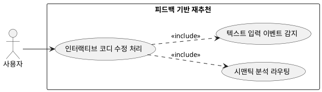

## 7.3 피드백 기반 재추천

### 개요
출력된 코디 결과물에 대해 유저가 일방적인 수용 대신 인터랙티브하게 가하는 정정 자연어 명령을 처리하여, 단일 세션 내에서 코디 후보군을 고도화하는 피드백 제어 기능이다.

### 요구사항

(Claude가 작성, 검토 필요)

1. 유저 인터페이스 창에 활성화된 텍스트 피드백 입력 이벤트를 감지한다.
2. 입력된 자연어 데이터를 백엔드 서버의 시맨틱 분석 파이프라인으로 전송한다.

---

### 유스케이스 다이어그램
