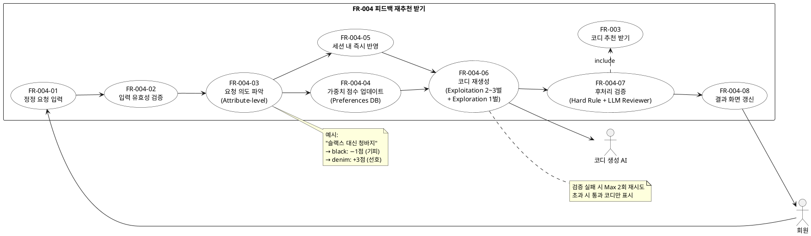

### 3.X 피드백 재추천 받기

### 3.X.1 기능 개요

| 항목      | 내용                                                                                                                                                                                                                  |
| --------- | --------------------------------------------------------------------------------------------------------------------------------------------------------------------------------------------------------------------- |
| 기능 ID   | FR-004                                                                                                                                                                                                                |
| 기능명    | 피드백 재추천 받기                                                                                                                                                                                                    |
| 관련 기능 | FR-003 코디 추천 받기 (선행 필수)                                                                                                                                                                                     |
| 행위자    | 회원, 코디 생성 AI                                                                                                                                                                                                    |
| 설명      | 회원이 추천받은 코디가 마음에 들지 않을 때, 자연어로 정정 요청을 입력하면 해당 내용을 반영하여 코디를 재생성하는 기능이다. 코디 추천 완료 후 이어서 사용하는 기능이며, 동일 세션 내에서 횟수 제한 없이 반복 가능하다. |

---

### 3.X.2 기능 요구사항 (Functional Requirements)

### FR-004-01 정정 요청 입력

| 항목        | 내용                                                                   |
| ----------- | ---------------------------------------------------------------------- |
| 요구사항 ID | FR-004-01                                                              |
| 요구사항명  | 정정 요청 입력                                                         |
| 설명        | 회원은 추천 화면에서 자연어 텍스트로 정정 요청을 입력할 수 있어야 한다 |
| 입력 예시   | "좀 더 캐주얼하게", "검정색 옷 비율 줄여줘", "덜 더워 보이게"          |
| 우선순위    | 상                                                                     |

### FR-004-02 입력 유효성 검증

| 항목        | 내용                                                                           |
| ----------- | ------------------------------------------------------------------------------ |
| 요구사항 ID | FR-004-02                                                                      |
| 요구사항명  | 입력 유효성 검증                                                               |
| 설명        | 시스템은 정정 요청 입력에 대해 아래 두 가지 검증을 수행해야 한다               |
| 검증 1      | 입력 길이 제한 확인 — 제한 초과 시 안내 메시지 표시 후 재입력 요청             |
| 검증 2      | 유해 입력 여부 필터링 — 유해 입력 감지 시 차단 안내 메시지 표시 후 재입력 요청 |
| 우선순위    | 상                                                                             |

### FR-004-03 요청 의도 파악 (Attribute-level Feedback)

| 항목        | 내용                                                                                             |
| ----------- | ------------------------------------------------------------------------------------------------ |
| 요구사항 ID | FR-004-03                                                                                        |
| 요구사항명  | 요청 의도 파악                                                                                   |
| 설명        | 시스템은 정정 요청 문장을 속성 단위(Attribute-level)로 분해하여 변경 대상과 의도를 파악해야 한다 |
| 처리 예시 1 | "슬랙스 대신 청바지로" → black: 기피(−1점), denim: 선호(+3점)                                    |
| 처리 예시 2 | "검정색 줄여줘" → black: 기피(−1점)                                                              |
| 처리 예시 3 | "덜 덥게" → 체감온도 기준 하향 조정                                                              |
| 우선순위    | 상                                                                                               |

### FR-004-04 가중치 점수 업데이트

| 항목        | 내용                                                                                      |
| ----------- | ----------------------------------------------------------------------------------------- |
| 요구사항 ID | FR-004-04                                                                                 |
| 요구사항명  | 가중치 점수 업데이트                                                                      |
| 설명        | FR-004-03에서 파악한 기피/선호 속성을 Preferences DB 누적 점수에 실시간으로 반영해야 한다 |
| 기피 속성   | 해당 스타일·색상 점수 −1점 반영                                                           |
| 선호 속성   | 해당 스타일·색상 점수 +3점 반영                                                           |
| 점수 범위   | Clip(−15, +30) 범위를 초과하지 않아야 한다                                                |
| 우선순위    | 상                                                                                        |

### FR-004-05 세션 내 즉시 반영

| 항목        | 내용                                                                                                                                             |
| ----------- | ------------------------------------------------------------------------------------------------------------------------------------------------ |
| 요구사항 ID | FR-004-05                                                                                                                                        |
| 요구사항명  | 세션 내 즉시 반영                                                                                                                                |
| 설명        | 파악된 기피 속성은 이번 추천 세션에 즉시 반영되어 재생성 시 해당 속성의 우선순위를 낮춰야 한다. DB 누적 점수 반영(FR-004-04)과 분리하여 처리한다 |
| 우선순위    | 상                                                                                                                                               |

### FR-004-06 코디 재생성

| 항목             | 내용                                                        |
| ---------------- | ----------------------------------------------------------- |
| 요구사항 ID      | FR-004-06                                                   |
| 요구사항명       | 코디 재생성                                                 |
| 설명             | 코디 생성 AI는 반영된 조건으로 코디를 재생성해야 한다       |
| 생성 구성        | Exploitation 코디 2\~3벌 + Exploration 코디 1벌 (총 3\~4벌) |
| Exploration 조건 | 기피 속성과 무관하게 현재 날씨·TPO 기준으로 생성            |
| 우선순위         | 상                                                          |

### FR-004-07 후처리 검증

| 항목        | 내용                                                                                 |
| ----------- | ------------------------------------------------------------------------------------ |
| 요구사항 ID | FR-004-07                                                                            |
| 요구사항명  | 후처리 검증                                                                          |
| 설명        | 재생성된 코디는 FR-003(코디 추천 받기)의 검증 과정과 동일한 2단계 검증을 거쳐야 한다 |
| 1차 검증    | Hard Rule — 상의·신발 누락, 계절 역행, 세트 간 중복 아이템 체크                      |
| 2차 검증    | LLM Fashion Reviewer — TPO 적합성, 색상 조화, 스타일 일관성                          |
| 재생성 처리 | 1차 실패 시 즉시 재생성, 2차 실패 시 실패 이유를 프롬프트에 주입 후 재생성           |
| 최대 재시도 | Max 2회, 초과 시 통과한 코디만 표시                                                  |
| 우선순위    | 상                                                                                   |

### FR-004-08 결과 화면 갱신

| 항목        | 내용                                                         |
| ----------- | ------------------------------------------------------------ |
| 요구사항 ID | FR-004-08                                                    |
| 요구사항명  | 결과 화면 갱신                                               |
| 설명        | 검증을 통과한 코디를 기존 추천 화면에 갱신하여 표시해야 한다 |
| 우선순위    | 상                                                           |

### FR-004-09 반복 정정 요청

| 항목        | 내용                                                                                              |
| ----------- | ------------------------------------------------------------------------------------------------- |
| 요구사항 ID | FR-004-09                                                                                         |
| 요구사항명  | 반복 정정 요청                                                                                    |
| 설명        | 회원은 재추천 결과를 확인한 후 동일 세션 내에서 횟수 제한 없이 추가 정정 요청을 할 수 있어야 한다 |
| 우선순위    | 중                                                                                                |

---

### 3.X.3 비기능 요구사항 (Non-Functional Requirements)

| 요구사항 ID | 항목          | 내용                                                                             |
| ----------- | ------------- | -------------------------------------------------------------------------------- |
| NFR-004-01  | 응답 시간     | 정정 요청 후 재추천 결과는 10초 이내(미정)에 표시되어야 한다                     |
| NFR-004-02  | 반복 가능성   | 정정 요청은 동일 세션 내에서 횟수 제한 없이 연속으로 가능해야 한다               |
| NFR-004-03  | 데이터 일관성 | Attribute-level Feedback 점수 반영은 실시간으로 Preferences DB에 저장되어야 한다 |
| NFR-004-04  | 점수 범위     | 가중치 점수는 Clip(−15, +30) 범위를 초과하지 않아야 한다                         |
| NFR-004-05  | 탐색 보장     | Exploration 코디 1벌은 기피 속성과 무관하게 반드시 포함되어야 한다               |

---

### 3.X.4 예외 처리

| 예외 ID   | 발생 조건                   | 처리 방법                                                         |
| --------- | --------------------------- | ----------------------------------------------------------------- |
| EX-004-01 | 입력 텍스트 길이 제한 초과  | 안내 메시지 표시 후 재입력 요청                                   |
| EX-004-02 | 유해 입력 감지              | 차단 안내 메시지 표시 후 재입력 요청                              |
| EX-004-03 | 1차 Hard Rule 검증 실패     | 실패 이유 포함하여 즉시 재생성 (Max 2회)                          |
| EX-004-04 | 2차 LLM Reviewer 검증 실패  | 실패 이유를 프롬프트에 주입 후 재생성 (Max 2회)                   |
| EX-004-05 | 재생성 2회 초과 후에도 실패 | 통과한 코디만 표시, 통과 코디 없을 시 오류 안내 후 기존 결과 유지 |
| EX-004-06 | FR-003 미완료 상태에서 요청 | 정정 요청 기능 비활성화 유지                                      |

