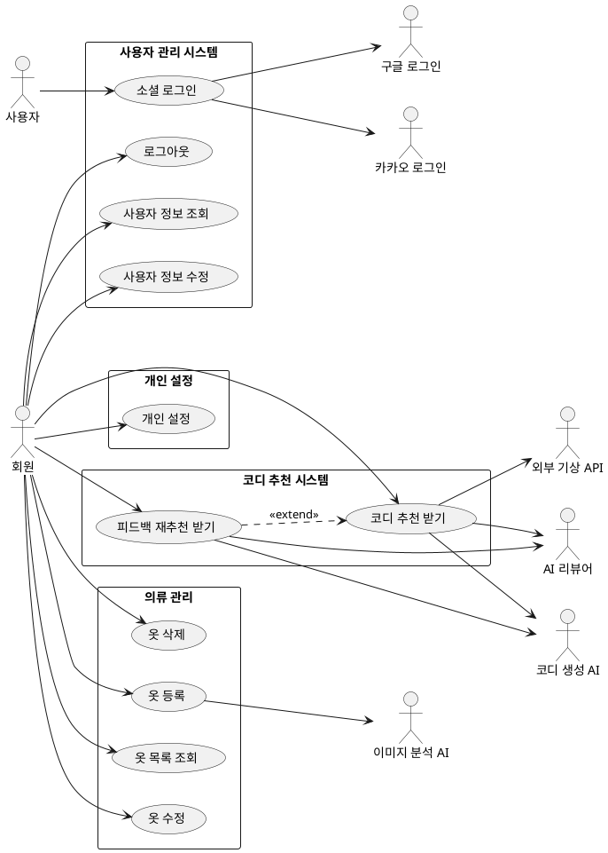

## 개요
옷장요정의 모든 기능을 한눈에 보기 위해, 각 영역(사용자 관리 시스템, 개인 설정, 의류 관리, 코디 추천 시스템)의 유스케이스를 하나의 다이어그램으로 모은 페이지다. 각 유스케이스의 상세한 요구사항은 해당 영역 페이지에서 다룬다.

## 유스케이스 다이어그램

```plantuml
@startuml
left to right direction
skinparam packageStyle rectangle
skinparam shadowing false

actor "사용자" as User
actor "회원" as Member
actor "구글 로그인" as Google
actor "카카오 로그인" as Kakao
actor "이미지 분석 AI" as ImageAI
actor "코디 생성 AI" as CodyAI
actor "AI 리뷰어" as Reviewer
actor "외부 기상 API" as Weather

rectangle "사용자 관리 시스템" {
  usecase "소셜 로그인" as Login
  usecase "로그아웃" as Logout
  usecase "사용자 정보 조회" as ViewUser
  usecase "사용자 정보 수정" as EditUser
}

rectangle "개인 설정" {
  usecase "개인 설정" as Settings
}

rectangle "의류 관리" {
  usecase "옷 등록" as ClothAdd
  usecase "옷 목록 조회" as ClothList
  usecase "옷 수정" as ClothEdit
  usecase "옷 삭제" as ClothDelete
}

rectangle "코디 추천 시스템" {
  usecase "코디 추천 받기" as Recommend
  usecase "피드백 재추천 받기" as Refeedback
}

User --> Login
Login --> Google
Login --> Kakao
Member --> Logout
Member --> ViewUser
Member --> EditUser
Member --> Settings
Member --> ClothAdd
Member --> ClothList
Member --> ClothEdit
Member --> ClothDelete
Member --> Recommend
Member --> Refeedback
ClothAdd --> ImageAI
Recommend --> CodyAI
Recommend --> Reviewer
Recommend --> Weather
Refeedback --> CodyAI
Refeedback --> Reviewer
Refeedback ..> Recommend : <<extend>>
@enduml
```
